# DevOps Spring 2026 - Packer & Terraform Infrastructure

Complete infrastructure-as-code solution using Packer to build custom AMIs and Terraform to deploy AWS infrastructure.

## Assignment Requirements

This project fulfills all requirements for the DevOps Spring 2026 Packer & Terraform assignment:

✅ **Custom AWS AMI** - Built with Packer containing:
- Amazon Linux 2023 (latest)
- Docker pre-installed and enabled
- SSH public key embedded for authentication

✅ **Terraform Infrastructure** - Provisioned using official modules:
- VPC with public and private subnets across 2 availability zones
- All necessary routes (Internet Gateway for public subnets, no NAT Gateway)
- 1 bastion host in public subnet (SSH access restricted to specific IP)
- 6 EC2 instances in private subnets using the custom AMI
- Security groups implementing least-privilege access

✅ **Documentation** - Comprehensive README with:
- Complete setup and usage instructions
- Architecture diagrams and network design
- AWS Console screenshots showing deployed infrastructure
- SSH connection examples and verification steps
- Troubleshooting guide and cleanup instructions

✅ **GitHub Repository** - All code committed with jsrahoi-dev profile

## Project Overview

This project demonstrates:
- **Custom AMI Creation**: Using Packer to build Amazon Linux 2023 images with Docker pre-installed
- **Infrastructure as Code**: Using Terraform to deploy production-ready AWS infrastructure
- **Network Architecture**: VPC with public/private subnets across 2 availability zones
- **Security Best Practices**: Bastion host architecture with proper security group configuration
- **SSH Key Management**: Using AWS EC2 Instance Connect for secure key distribution

## Architecture

```
VPC (10.0.0.0/16)
├── Public Subnets (2 AZs)
│   ├── us-east-1a: 10.0.1.0/24
│   └── us-east-1b: 10.0.2.0/24
│       └── Bastion Host (public IP for SSH access)
│
└── Private Subnets (2 AZs)
    ├── us-east-1a: 10.0.101.0/24
    │   └── 3 Private Instances (Docker-enabled)
    └── us-east-1b: 10.0.102.0/24
        └── 3 Private Instances (Docker-enabled)
```

### Components

1. **VPC Configuration**
   - CIDR: 10.0.0.0/16
   - 2 Public Subnets (for bastion and future load balancers)
   - 2 Private Subnets (for application instances)
   - Internet Gateway for public subnet access
   - NAT Gateway for private subnet outbound access

2. **EC2 Instances**
   - 1 Bastion Host (t2.micro in public subnet)
   - 6 Private Instances (t2.micro in private subnets, 3 per AZ)
   - All using custom AMI with Docker pre-installed

3. **Security Groups**
   - Bastion SG: SSH (22) from your IP only
   - Private SG: SSH (22) from bastion, HTTP/HTTPS for future apps

## Prerequisites

- AWS CLI configured with appropriate credentials
- Packer installed (version 1.8+)
- Terraform installed (version 1.0+)
- SSH key pair (ED25519 recommended)
- Git configured with your identity

## Directory Structure

```
devops-spring26-packer-terraform/
├── packer/
│   ├── variables.pkr.hcl          # Packer variable definitions
│   ├── amazon-linux-docker.pkr.hcl # Main Packer template
│   └── packer-manifest.json       # Build manifest with AMI ID
├── terraform/
│   ├── variables.tf               # Terraform variable definitions
│   ├── vpc.tf                     # VPC and networking resources
│   ├── security_groups.tf         # Security group configurations
│   ├── main.tf                    # EC2 instances and main resources
│   ├── outputs.tf                 # Output values
│   └── terraform.tfvars           # Variable values (created after Packer build)
├── docs/
│   ├── screenshots/               # AWS Console and terminal screenshots
│   │   ├── 01-ami-console.png    # Custom AMI in AWS console
│   │   ├── 02-aws-vpc.png        # VPC configuration
│   │   ├── 03-aws-subnets.png    # Subnet layout
│   │   ├── 04-aws-instances.png  # EC2 instances
│   │   ├── 05-aws-security-groups.png # Security groups
│   │   ├── 06-bastion-ssh.png    # Bastion SSH connection
│   │   ├── 07-private-ssh.png    # Private instance SSH
│   │   └── 08-all-private-ips.png # All instances tested
│   └── superpowers/               # Design specs and implementation plans
├── README.md                      # This file
├── VERIFICATION.md                # Infrastructure verification report
└── CLEANUP.md                     # Resource cleanup instructions
```

## Setup Instructions

### Step 1: Initial Setup

```bash
# Clone the repository
git clone <repository-url>
cd devops-spring26-packer-terraform

# Configure git identity (if not already configured)
git config user.name "Your Name"
git config user.email "your.email@example.com"
```

### Step 2: Build Custom AMI with Packer

```bash
cd packer

# Initialize Packer (downloads required plugins)
packer init .

# Validate Packer configuration
packer validate .

# Build the AMI
packer build .
```

The Packer build process will:
1. Launch a temporary EC2 instance (Amazon Linux 2023)
2. Install Docker and enable the service
3. Upload your SSH public key via EC2 Instance Connect
4. Create a custom AMI
5. Terminate the temporary instance
6. Output the AMI ID (save this for Terraform)

**Expected Output:**
```
Build 'amazon-ebs.docker_ami' finished after X minutes.

==> Builds finished. The artifacts of successful builds are:
--> amazon-ebs.docker_ami: AMIs were created:
us-east-1: ami-xxxxxxxxxxxxxxxxx
```

### Step 3: Deploy Infrastructure with Terraform

```bash
cd ../terraform

# Create terraform.tfvars with the AMI ID from Packer
cat > terraform.tfvars <<EOF
custom_ami_id = "ami-xxxxxxxxxxxxxxxxx"  # Replace with your AMI ID
EOF

# Initialize Terraform (downloads providers)
terraform init

# Validate configuration
terraform validate

# Preview changes
terraform plan

# Deploy infrastructure
terraform apply
```

Review the plan carefully and type `yes` when prompted.

**Expected Outputs:**
- Bastion public IP and connection command
- Private instance IPs
- SSH configuration snippet
- VPC and subnet IDs

### Step 4: Configure SSH Access

Terraform outputs an SSH config snippet. Add it to `~/.ssh/config`:

```bash
# Display the SSH config snippet
terraform output -raw ssh_config_snippet

# Or automatically append to SSH config
terraform output -raw ssh_config_snippet >> ~/.ssh/config
```

### Step 5: Test SSH Connectivity

```bash
# Connect to bastion
ssh -i ~/.ssh/your-key-name ec2-user@<bastion-public-ip>

# From bastion, connect to private instance
ssh ec2-user@10.0.101.X

# Or use ProxyJump directly from your machine
ssh -J ec2-user@<bastion-public-ip> ec2-user@10.0.101.X

# Verify Docker on private instance
docker --version
docker ps
```

## AWS Console Verification

Verify your infrastructure in the AWS Console:

### 1. AMI Management
   - Navigate to EC2 → AMIs
   - Verify your custom AMI is available
   - Check AMI name and creation date

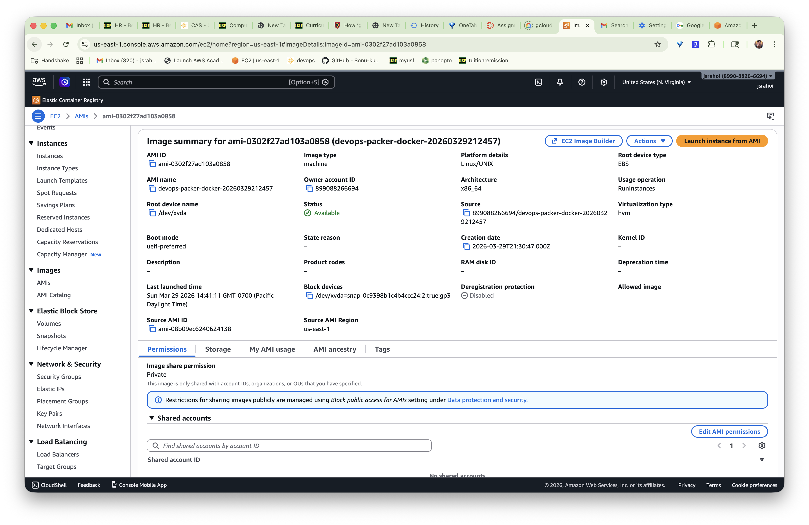
*Custom Amazon Linux 2023 AMI with Docker pre-installed*

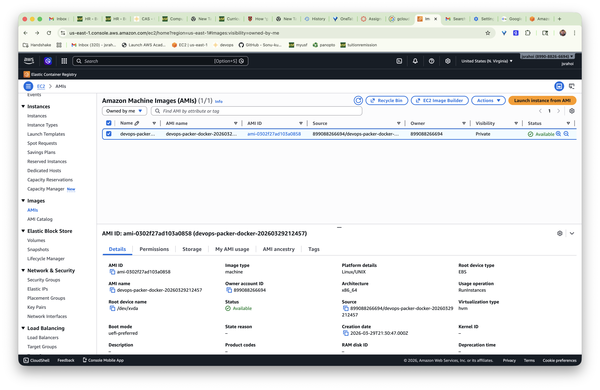
*AMI visible in console with all tags*

### 2. VPC Dashboard
   - Navigate to VPC → Your VPCs
   - Verify VPC with correct CIDR block
   - Check subnets (2 public + 2 private)
   - Verify route tables and associations
   - Check Internet Gateway and NAT Gateway

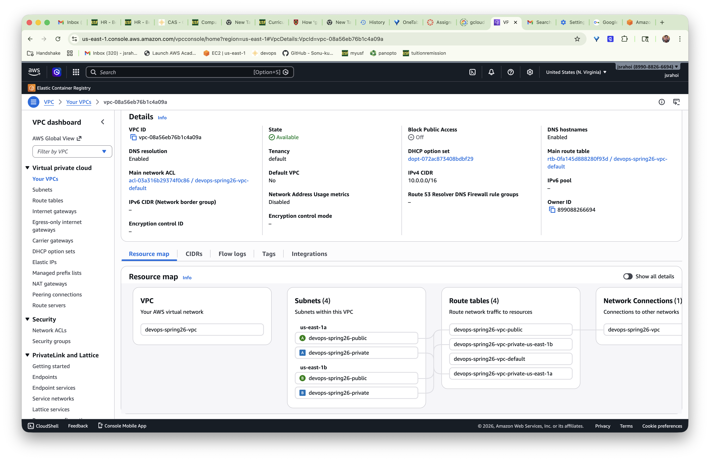
*VPC configuration with 10.0.0.0/16 CIDR block*

### 3. Subnets Configuration
   - Verify 2 public subnets (10.0.1.0/24, 10.0.2.0/24)
   - Verify 2 private subnets (10.0.101.0/24, 10.0.102.0/24)

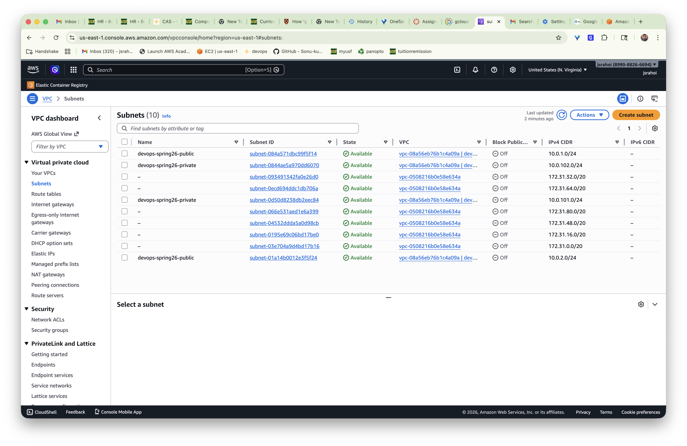
*Public and private subnets across 2 availability zones*

### 4. EC2 Instances
   - Navigate to EC2 → Instances
   - Verify 7 instances running (1 bastion + 6 private)
   - Check instance states and IPs

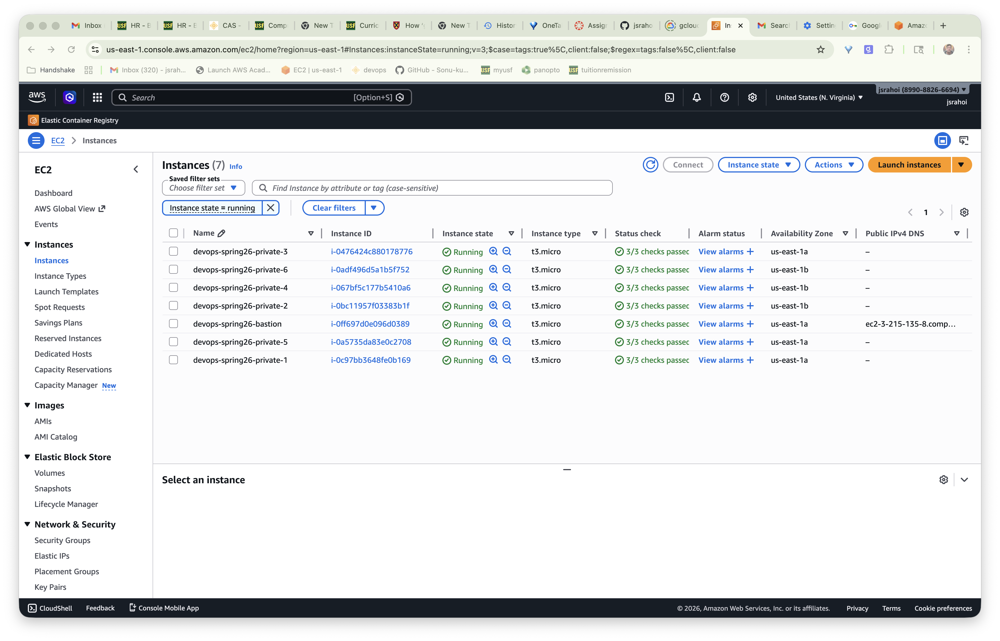
*1 bastion host in public subnet and 6 private instances*

### 5. Security Groups
   - Navigate to EC2 → Security Groups
   - Verify bastion and private security groups
   - Review inbound/outbound rules

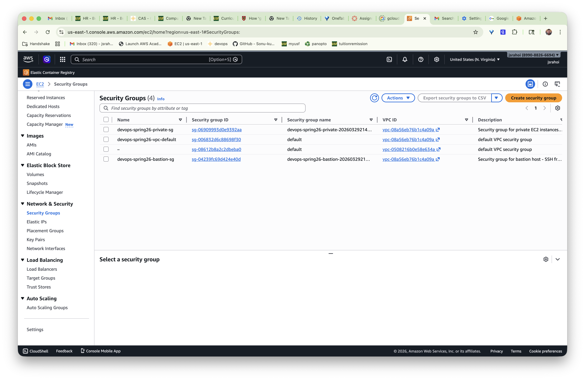
*Bastion and private security groups*

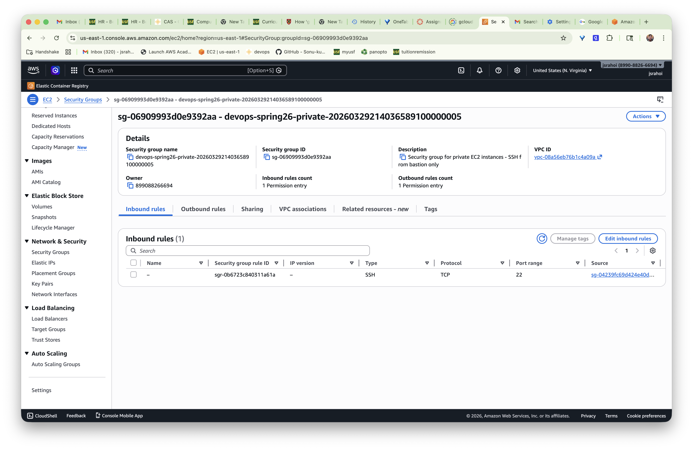
*Bastion SG - SSH from specific IP only*

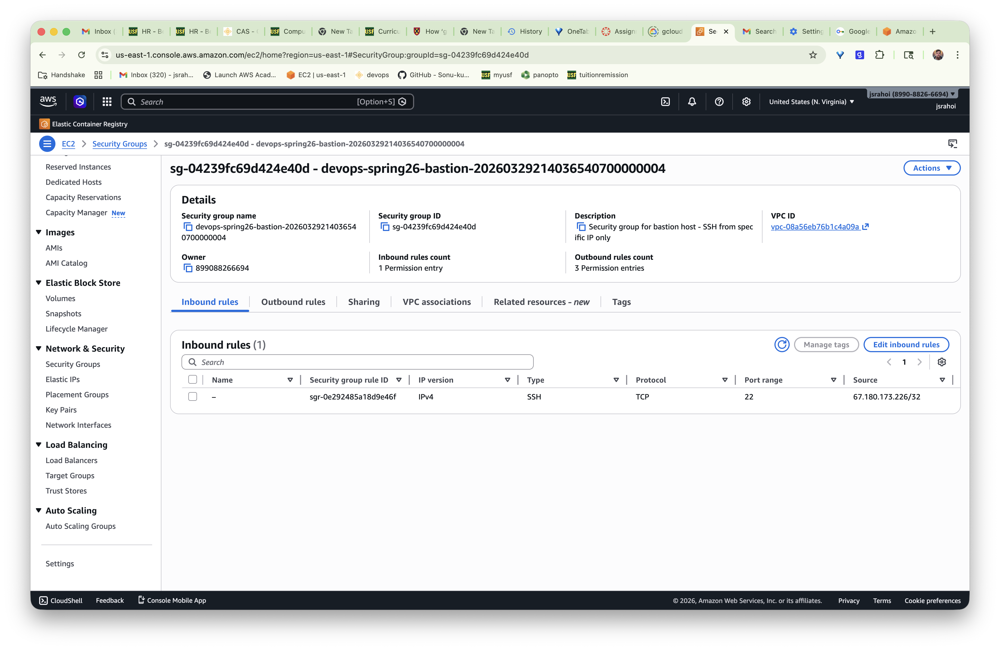
*Private SG - SSH from bastion only*

## SSH Configuration Details

### Option 1: Direct SSH with ProxyJump

```bash
# Connect to bastion
ssh -i ~/.ssh/your-key ec2-user@<bastion-ip>

# Connect to private instance through bastion
ssh -i ~/.ssh/your-key -J ec2-user@<bastion-ip> ec2-user@10.0.101.X
```

### Option 2: Using SSH Config File

Add to `~/.ssh/config`:

```
Host devops-spring26-bastion
  HostName <bastion-public-ip>
  User ec2-user
  IdentityFile ~/.ssh/your-key

Host devops-spring26-private-*
  User ec2-user
  IdentityFile ~/.ssh/your-key
  ProxyJump devops-spring26-bastion
```

Then connect simply:

```bash
ssh devops-spring26-bastion
ssh devops-spring26-private-10.0.101.X
```

## Testing and Verification

### Verify Packer Build

```bash
# List AMIs
aws ec2 describe-images --owners self --query 'Images[*].[ImageId,Name,CreationDate]' --output table

# Get specific AMI details
aws ec2 describe-images --image-ids ami-xxxxxxxxxxxxxxxxx
```

### Verify Terraform State

```bash
cd terraform

# List all resources
terraform state list

# Show specific resource
terraform state show aws_instance.bastion
terraform state show 'aws_instance.private[0]'

# Show all outputs
terraform output

# Show specific output
terraform output bastion_public_ip
```

### Verify Network Connectivity

```bash
# Test bastion SSH
ssh -i ~/.ssh/your-key ec2-user@<bastion-ip> "echo 'Bastion connected successfully'"

# Test private instance SSH through bastion
ssh -i ~/.ssh/your-key -J ec2-user@<bastion-ip> ec2-user@10.0.101.X "echo 'Private instance connected'"

# Verify Docker on private instance
ssh -i ~/.ssh/your-key -J ec2-user@<bastion-ip> ec2-user@10.0.101.X "docker --version"
```

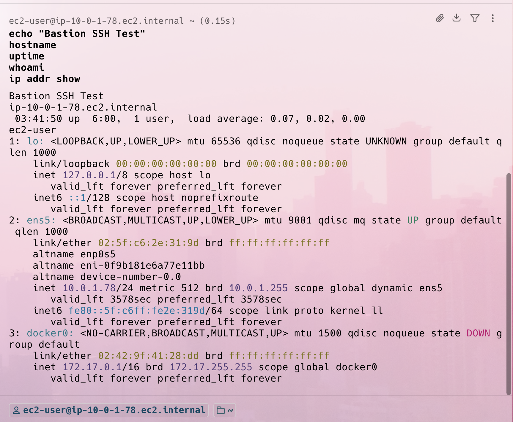
*Successfully connected to bastion host with Docker verification*

### Verify All Private Instances

Test connectivity to all 6 private instances (3 in each AZ):

```bash
# Get all private IPs from Terraform
terraform output -json private_instance_ips

# Test each one
for ip in $(terraform output -json private_instance_ips | jq -r '.[]'); do
  echo "Testing $ip..."
  ssh -i ~/.ssh/your-key -J ec2-user@<bastion-ip> ec2-user@$ip "hostname && docker --version"
done
```

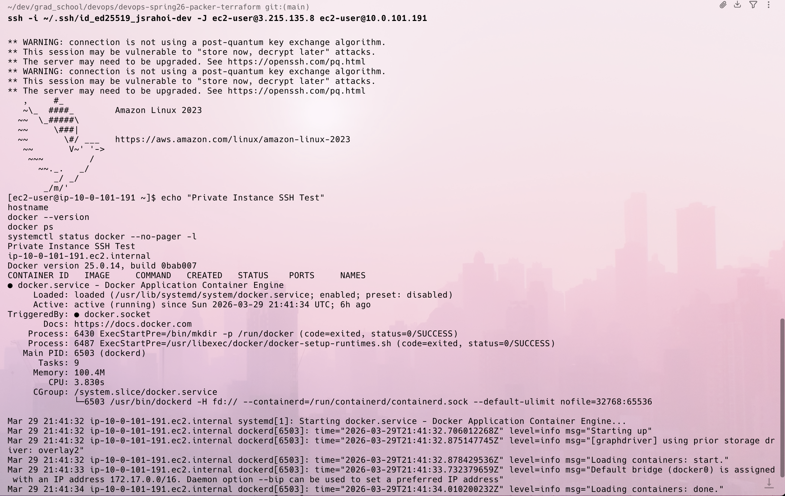
*Connected to private instance via bastion and verified Docker*

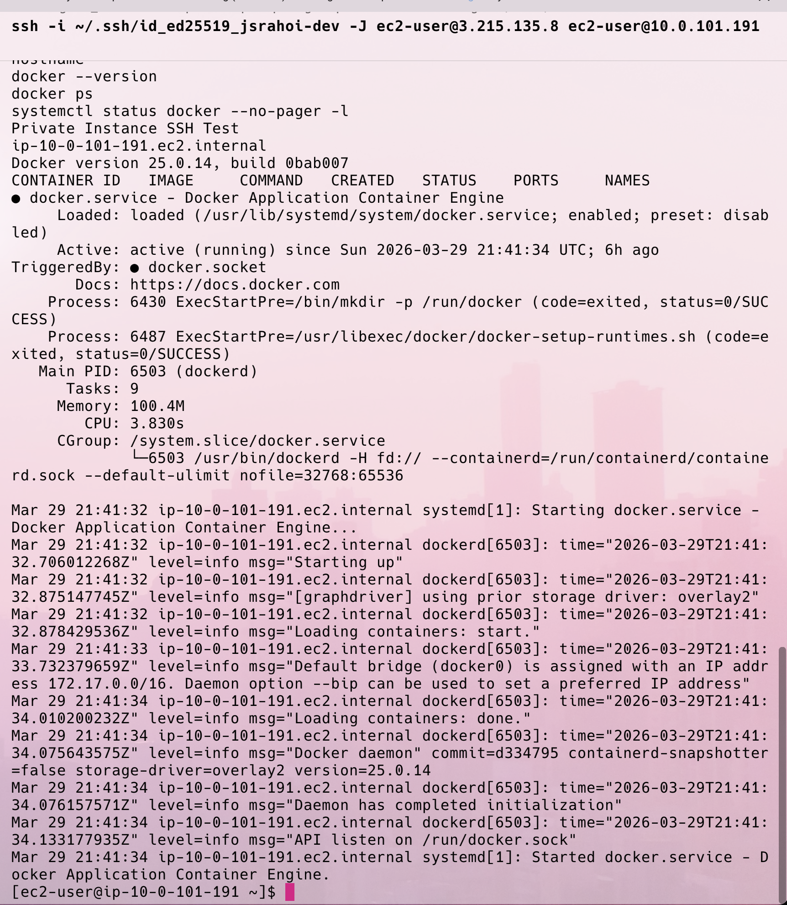
*Additional private instance connectivity verification*

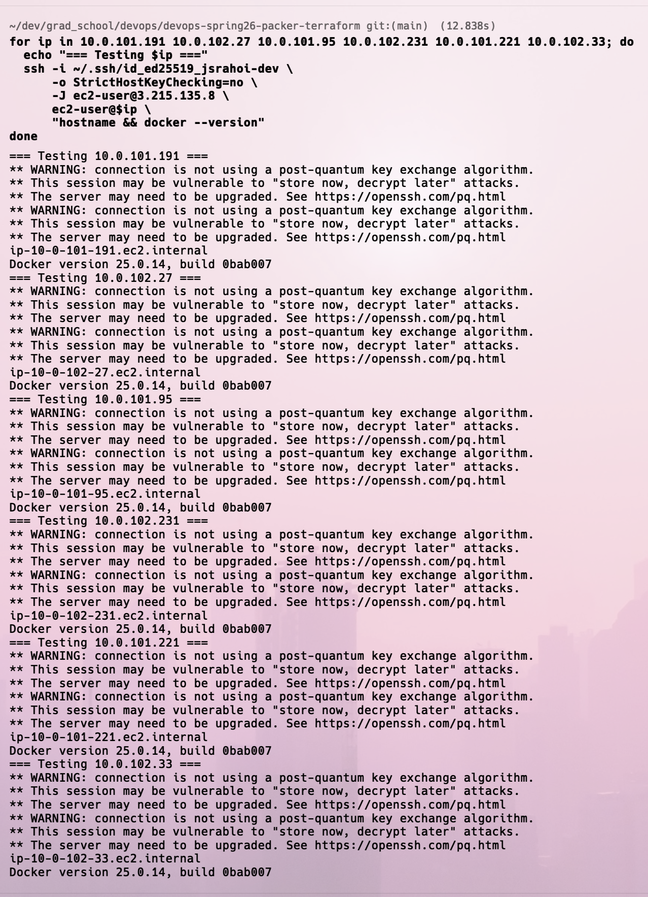
*All 6 private instances accessible and tested*

## Terraform Commands Reference

```bash
# Initialize Terraform
terraform init

# Format Terraform files
terraform fmt

# Validate configuration
terraform validate

# Plan changes
terraform plan

# Apply changes
terraform apply

# Apply without confirmation (use with caution)
terraform apply -auto-approve

# Destroy all resources
terraform destroy

# List all resources
terraform state list

# Show specific resource
terraform state show <resource-name>

# Show all outputs
terraform output

# Show specific output as JSON
terraform output -json <output-name>

# Refresh state from AWS
terraform refresh

# Import existing resource
terraform import <resource-type>.<name> <resource-id>
```

## Packer Commands Reference

```bash
# Initialize Packer
packer init .

# Format Packer files
packer fmt .

# Validate configuration
packer validate .

# Build AMI
packer build .

# Build with specific variables
packer build -var 'region=us-west-2' .

# Build with variable file
packer build -var-file=custom.pkrvars.hcl .

# Debug mode
PACKER_LOG=1 packer build .

# Inspect template
packer inspect .
```

## Cleanup Instructions

When you're done with the infrastructure:

```bash
cd terraform

# Destroy all Terraform-managed resources
terraform destroy

# Review what will be destroyed, then type 'yes'
```

To also remove the custom AMI:

```bash
# Get AMI ID
AMI_ID=$(aws ec2 describe-images --owners self --query 'Images[0].ImageId' --output text)

# Deregister AMI
aws ec2 deregister-image --image-id $AMI_ID

# Get and delete associated snapshot
SNAPSHOT_ID=$(aws ec2 describe-snapshots --owner-ids self --query 'Snapshots[0].SnapshotId' --output text)
aws ec2 delete-snapshot --snapshot-id $SNAPSHOT_ID
```

## Troubleshooting

### Packer Build Fails

**Problem**: Packer build fails with authentication error

**Solution**:
```bash
# Verify AWS credentials
aws sts get-caller-identity

# Check AWS region
aws configure get region

# Ensure you have necessary IAM permissions
```

**Problem**: SSH timeout during Packer build

**Solution**:
- Check security group allows SSH from 0.0.0.0/0 during build
- Verify VPC has internet connectivity
- Check temporary security group in AWS Console

### Terraform Apply Fails

**Problem**: "AMI not found" error

**Solution**:
- Verify AMI ID in terraform.tfvars is correct
- Ensure AMI is in the same region as Terraform deployment
- Check AMI is not deregistered

**Problem**: VPC CIDR conflicts

**Solution**:
```bash
# Check existing VPCs
aws ec2 describe-vpcs --query 'Vpcs[*].[VpcId,CidrBlock]' --output table

# Modify CIDR in vpc.tf if needed
```

### SSH Connection Issues

**Problem**: Cannot connect to bastion

**Solution**:
- Verify your public IP hasn't changed (Terraform detects it automatically)
- Check security group allows SSH from your IP
- Ensure SSH key permissions are correct (chmod 600)

**Problem**: Cannot connect to private instances

**Solution**:
- Verify bastion is running
- Check private instance security group allows SSH from bastion SG
- Ensure SSH key is the same one uploaded via EC2 Instance Connect

### Docker Not Found on Instance

**Problem**: Docker command not found

**Solution**:
- Verify you're using the custom AMI, not the base Amazon Linux 2023
- Check Packer build completed successfully
- SSH to instance and check: `systemctl status docker`

## Security Best Practices

1. **SSH Keys**
   - Use ED25519 keys (more secure and faster than RSA)
   - Never commit private keys to git
   - Rotate keys regularly
   - Use different keys for different environments

2. **Security Groups**
   - Bastion only allows SSH from your IP
   - Private instances only allow SSH from bastion
   - Use security group IDs for internal references (not CIDR blocks)

3. **Terraform State**
   - Never commit terraform.tfstate to git
   - Consider using remote state (S3 + DynamoDB) for team collaboration
   - Enable state locking to prevent concurrent modifications

4. **Credentials**
   - Never hardcode AWS credentials in code
   - Use AWS CLI profiles or IAM roles
   - Rotate access keys regularly

## Resource Naming Convention

All resources use consistent naming:
- Format: `devops-spring26-<resource-type>[-<suffix>]`
- Examples:
  - VPC: `devops-spring26-vpc`
  - Bastion: `devops-spring26-bastion`
  - Private instances: `devops-spring26-private-1` through `devops-spring26-private-6`
  - Security groups: `devops-spring26-bastion-sg`, `devops-spring26-private-sg`

## Cost Considerations

This infrastructure uses free-tier eligible resources where possible:
- **t2.micro instances**: Eligible for free tier (750 hours/month)
- **NAT Gateway**: ~$0.045/hour (~$32/month) - consider removing if not needed
- **EBS volumes**: Free tier includes 30GB
- **Data transfer**: Stay within free tier limits

To minimize costs:
- Destroy infrastructure when not in use: `terraform destroy`
- Consider using NAT instance instead of NAT Gateway for learning
- Monitor AWS billing dashboard regularly

## Monitoring with Prometheus and Grafana

This project includes a comprehensive monitoring solution using Prometheus for metrics collection and Grafana for visualization.

### Monitoring Architecture

```
                                    ┌─────────────────────────────────────┐
                                    │     Public Subnet (us-east-1b)      │
                                    │                                     │
                                    │  ┌───────────────────────────────┐ │
                                    │  │   Monitoring Instance         │ │
                                    │  │   54.208.66.53               │ │
                                    │  │                               │ │
                                    │  │  ┌─────────────────────────┐ │ │
                                    │  │  │   Prometheus :9090      │ │ │
                                    │  │  │   - Metrics storage     │ │ │
                                    │  │  │   - Time-series DB      │ │ │
                                    │  │  │   - Service discovery   │ │ │
                                    │  │  └─────────────────────────┘ │ │
                                    │  │                               │ │
                                    │  │  ┌─────────────────────────┐ │ │
                                    │  │  │   Grafana :3000         │ │ │
                                    │  │  │   - Dashboards          │ │ │
                                    │  │  │   - Visualization       │ │ │
                                    │  │  │   - Alerts              │ │ │
                                    │  │  └─────────────────────────┘ │ │
                                    │  └───────────────────────────────┘ │
                                    └─────────────────────────────────────┘
                                                     │
                                                     │ Scrape metrics
                                                     │ every 15s
                                                     ▼
                    ┌────────────────────────────────────────────────────────┐
                    │              Private Subnets                           │
                    │                                                        │
                    │  ┌──────────────┐  ┌──────────────┐  ┌──────────────┐│
                    │  │  Instance 1  │  │  Instance 2  │  │  Instance 3  ││
                    │  │  :9100       │  │  :9100       │  │  :9100       ││
                    │  │ node_exporter│  │ node_exporter│  │ node_exporter││
                    │  └──────────────┘  └──────────────┘  └──────────────┘│
                    │                                                        │
                    │  ┌──────────────┐  ┌──────────────┐  ┌──────────────┐│
                    │  │  Instance 4  │  │  Instance 5  │  │  Instance 6  ││
                    │  │  :9100       │  │  :9100       │  │  :9100       ││
                    │  │ node_exporter│  │ node_exporter│  │ node_exporter││
                    │  └──────────────┘  └──────────────┘  └──────────────┘│
                    └────────────────────────────────────────────────────────┘
```

### Components

1. **Prometheus Server**
   - Collects metrics from all 6 private instances
   - Stores time-series data
   - Provides PromQL query interface
   - Scrapes node_exporter every 15 seconds
   - Retention: 15 days of metrics data

2. **Grafana Server**
   - Visualizes Prometheus metrics
   - Pre-configured dashboard for instance monitoring
   - Shows CPU, memory, disk, and network metrics
   - Auto-provisioned data source and dashboard

3. **Node Exporter (on each private instance)**
   - Exposes system metrics on port 9100
   - Collects CPU, memory, disk, network stats
   - Lightweight agent (~10MB RAM)

### Data Flow

1. Node exporters expose metrics on each private instance
2. Prometheus scrapes metrics every 15 seconds
3. Metrics stored in Prometheus time-series database
4. Grafana queries Prometheus for visualization
5. Dashboard updates in real-time

### Accessing Monitoring Services

#### Prometheus Web UI

```
URL: http://54.208.66.53:9090
```

Access Prometheus to:
- Execute PromQL queries
- View targets and service discovery
- Check alerting rules
- Browse metrics catalog

#### Grafana Dashboard

```
URL: http://54.208.66.53:3000
Username: admin
Password: admin
```

On first login, Grafana will prompt you to change the default password.

### Using Prometheus

#### Prometheus Targets

Navigate to `Status → Targets` to verify all 6 instances are being monitored:

- Should show 6 targets in "UP" state
- Each target shows last scrape time
- Any issues appear with error messages

#### Sample PromQL Queries

Execute these queries in the Prometheus Graph interface:

**CPU Usage by Instance:**
```promql
100 - (avg by(instance) (rate(node_cpu_seconds_total{mode="idle"}[5m])) * 100)
```

**Memory Usage Percentage:**
```promql
100 * (1 - (node_memory_MemAvailable_bytes / node_memory_MemTotal_bytes))
```

**Disk Space Available:**
```promql
node_filesystem_avail_bytes{mountpoint="/"}
```

**Network Traffic (received):**
```promql
rate(node_network_receive_bytes_total[5m])
```

**System Load Average:**
```promql
node_load1
```

**Uptime (in hours):**
```promql
(node_time_seconds - node_boot_time_seconds) / 3600
```

### Using Grafana

#### Pre-configured Dashboard

The "Instance Monitoring" dashboard is automatically provisioned and includes:

1. **Overview Panel**
   - Total instances monitored
   - Average CPU usage
   - Average memory usage
   - Total network traffic

2. **Per-Instance Metrics**
   - CPU usage graph
   - Memory usage graph
   - Disk usage
   - Network I/O
   - System load

3. **Time Range Selection**
   - Last 5 minutes, 15 minutes, 1 hour, 6 hours, 24 hours
   - Custom time ranges
   - Auto-refresh options

#### Creating Custom Dashboards

1. Click "+" → "Dashboard" → "Add visualization"
2. Select "Prometheus" as data source
3. Enter PromQL query
4. Choose visualization type (graph, gauge, stat, table)
5. Save dashboard

#### Setting Up Alerts

1. Edit any panel
2. Go to "Alert" tab
3. Create alert rule with threshold
4. Configure notification channels (email, Slack, etc.)

### Verifying Monitoring Stack

Run these checks to verify everything is working:

```bash
# Check Prometheus is scraping all targets
curl -s http://54.208.66.53:9090/api/v1/targets | jq '.data.activeTargets[] | {instance: .labels.instance, health: .health}'

# Query current CPU usage
curl -s 'http://54.208.66.53:9090/api/v1/query?query=node_load1' | jq '.data.result[] | {instance: .metric.instance, load: .value[1]}'

# Check Grafana health
curl -s http://54.208.66.53:3000/api/health | jq

# Verify all node exporters are responding
for ip in 10.0.101.X 10.0.101.Y 10.0.102.X 10.0.102.Y 10.0.102.Z 10.0.101.Z; do
  echo "Checking $ip..."
  ssh -J devops-spring26-bastion ec2-user@$ip "curl -s localhost:9100/metrics | grep node_cpu_seconds_total | head -1"
done
```

### Monitoring Screenshots

#### 1. Prometheus Targets

*All 6 private instances showing as UP in Prometheus targets*

#### 2. Prometheus Query Results

*PromQL query showing CPU usage across all instances*

#### 3. Grafana Dashboard Overview

*Instance monitoring dashboard with all metrics*

#### 4. Grafana CPU Metrics

*Detailed CPU usage graphs per instance*

#### 5. Grafana Memory Metrics

*Memory usage visualization across instances*

#### 6. Grafana Data Source

*Auto-provisioned Prometheus data source configuration*

### Troubleshooting Monitoring

#### Prometheus Not Scraping Targets

**Problem**: Targets show as "DOWN" in Prometheus

**Solution**:
```bash
# Check security group allows port 9100 from monitoring instance
# Verify node_exporter is running on private instances
ssh -J devops-spring26-bastion ec2-user@10.0.101.X "sudo systemctl status node_exporter"

# Test connectivity from monitoring instance
ssh ec2-user@54.208.66.53 "curl -s http://10.0.101.X:9100/metrics | head"
```

#### Grafana Not Connecting to Prometheus

**Problem**: Dashboard shows "No Data"

**Solution**:
1. Check Prometheus is running: `http://54.208.66.53:9090`
2. Verify data source configuration in Grafana
3. Test data source connection in Grafana settings
4. Check Prometheus has data: `http://54.208.66.53:9090/graph`

#### Node Exporter Not Running

**Problem**: Metrics not being collected from an instance

**Solution**:
```bash
# SSH to the instance
ssh -J devops-spring26-bastion ec2-user@10.0.101.X

# Check node_exporter status
sudo systemctl status node_exporter

# Restart if needed
sudo systemctl restart node_exporter

# Verify metrics endpoint
curl localhost:9100/metrics | head
```

#### High Resource Usage

**Problem**: Prometheus using too much memory/disk

**Solution**:
- Adjust retention period (default: 15 days)
- Reduce scrape interval (default: 15s)
- Edit `/etc/prometheus/prometheus.yml` on monitoring instance
- Restart Prometheus: `sudo systemctl restart prometheus`

## Learning Outcomes

By completing this project, you have:
1. Built custom AMIs with Packer
2. Deployed multi-tier VPC architecture with Terraform
3. Implemented bastion host security pattern
4. Configured SSH key distribution with EC2 Instance Connect
5. Practiced infrastructure-as-code principles
6. Used AWS CLI for resource verification
7. Documented infrastructure thoroughly
8. Deployed and configured Prometheus for metrics collection
9. Set up Grafana for monitoring visualization
10. Implemented node_exporter on multiple instances
11. Created custom PromQL queries for system metrics
12. Configured auto-provisioned dashboards and data sources

## Additional Resources

### Infrastructure as Code
- [Packer Documentation](https://www.packer.io/docs)
- [Terraform AWS Provider](https://registry.terraform.io/providers/hashicorp/aws/latest/docs)
- [AWS VPC Best Practices](https://docs.aws.amazon.com/vpc/latest/userguide/vpc-security-best-practices.html)
- [AWS Bastion Host Pattern](https://aws.amazon.com/solutions/implementations/linux-bastion/)
- [EC2 Instance Connect](https://docs.aws.amazon.com/AWSEC2/latest/UserGuide/ec2-instance-connect-methods.html)

### Monitoring and Observability
- [Prometheus Documentation](https://prometheus.io/docs/introduction/overview/)
- [PromQL Query Examples](https://prometheus.io/docs/prometheus/latest/querying/examples/)
- [Grafana Documentation](https://grafana.com/docs/grafana/latest/)
- [Node Exporter Guide](https://prometheus.io/docs/guides/node-exporter/)
- [Grafana Dashboard Best Practices](https://grafana.com/docs/grafana/latest/dashboards/build-dashboards/best-practices/)

## License

This project is for educational purposes as part of DevOps Spring 2026 coursework.

## Author

Created for DevOps Spring 2026 course.